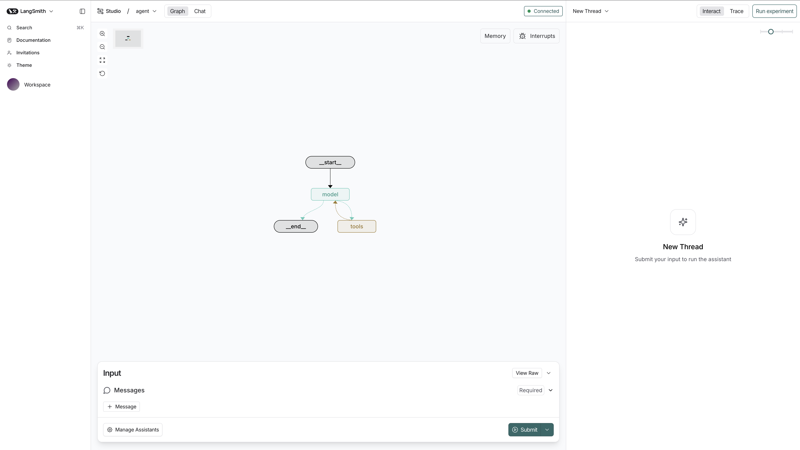
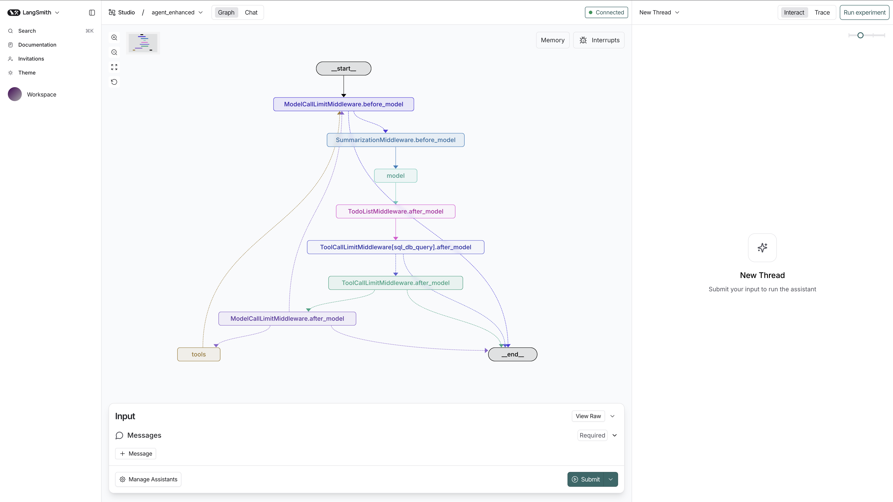
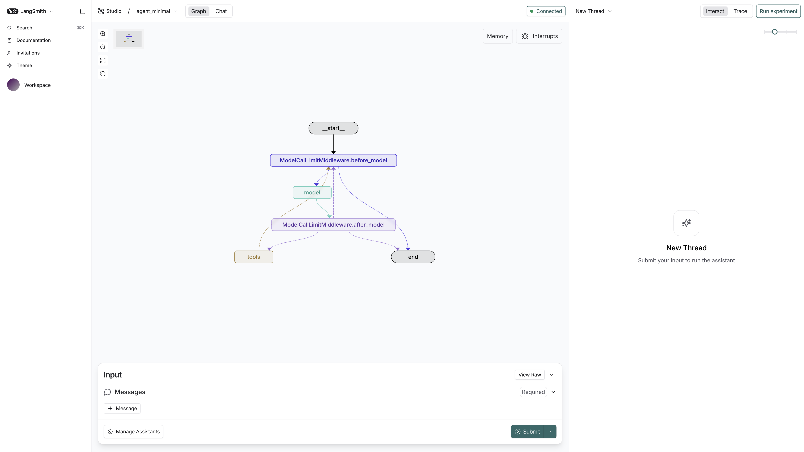
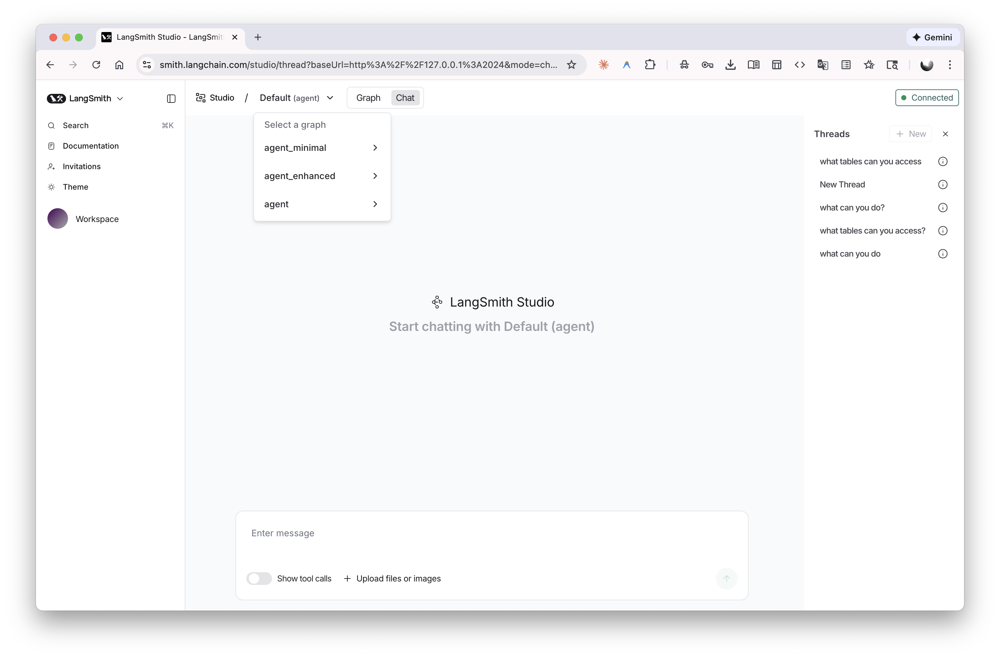
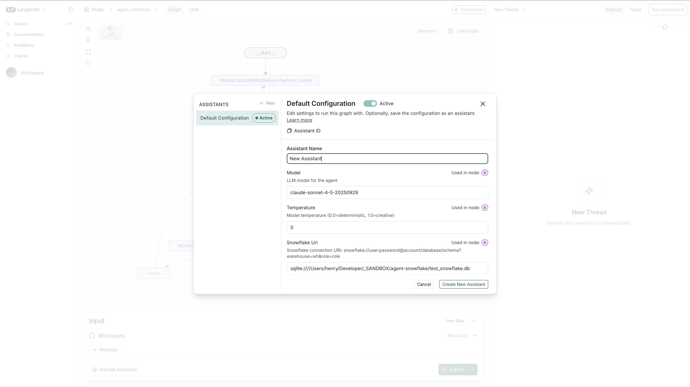

# agent-snowflake

LangGraph agents for querying Snowflake databases using LangChain's SQL toolkit.

## Quick Start

```bash
make install
make setup-fakesnow  # SQLite stub for local dev
make dev             # LangGraph Studio at localhost:2024
```

## Agent Variants

- **agent** - Core SQL agent with LangChain toolkit
- **agent_minimal** - Adds guardrails and context controls
- **agent_enhanced** - Full featured with extended tooling

## Architecture

<table>
  <tr>
    <td></td>
    <td></td>
  </tr>
  <tr>
    <td></td>
    <td></td>
  </tr>
  <tr>
    <td colspan="2" align="center"></td>
  </tr>
</table>

## Development

```bash
make test          # Run tests
make format        # Ruff formatting
make type-check    # ty type checker
```

See `Makefile` for additional commands (setup-chinook, test-fast, lint, clean).

## Notes

- LANGSMITH_API_KEY optional
- API docs at localhost:2024/docs
- Safari requires `--tunnel` flag
- Config precedence: defaults → environment → overrides

---

### Try Prompt
```
Answer below questions, one at a time:

“For each billing country, what is total invoice revenue, number of invoices, and average invoice total? Rank countries by total revenue (desc) and return the top 10.”


“List the top 10 artists by total sales revenue. For each artist, include total revenue, number of distinct tracks sold, and number of distinct customers.”


“For each customer, compute: first purchase date, last purchase date, total spend, and number of distinct purchase months. Then return the 20 customers with the most distinct purchase months (tie-break by total spend).”

```