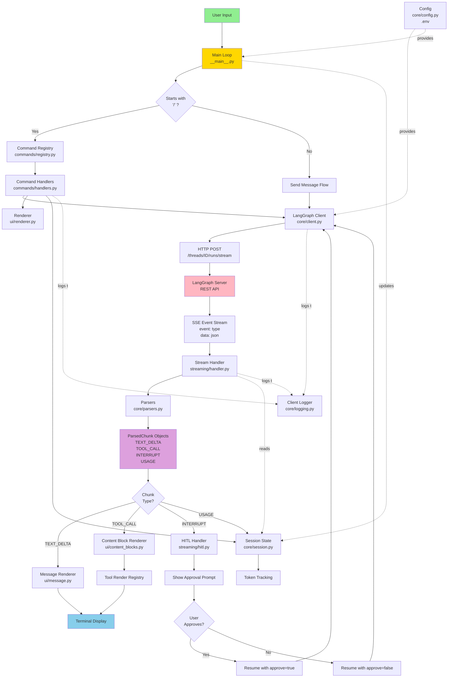
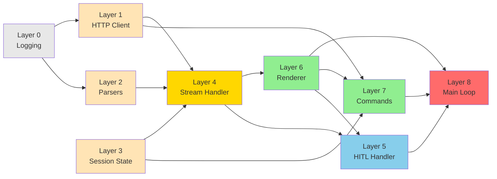
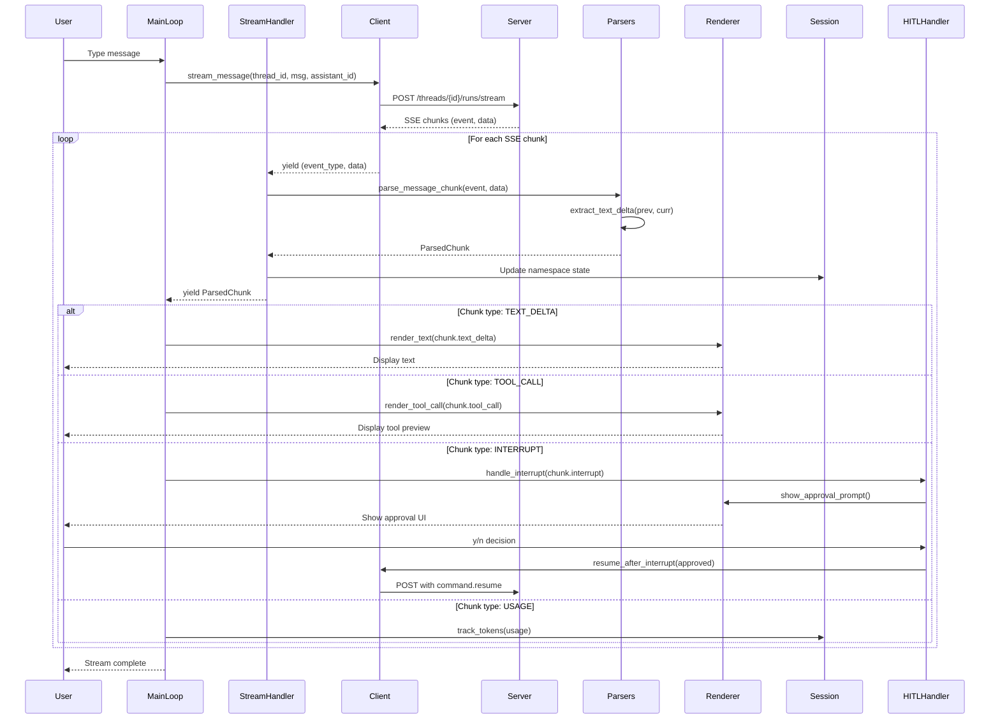
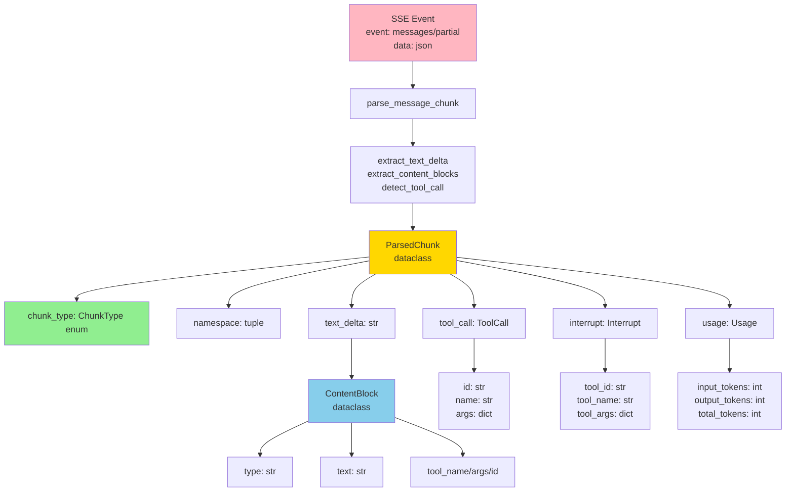
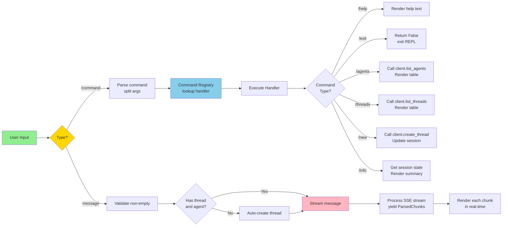
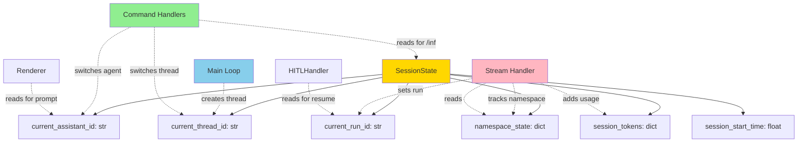
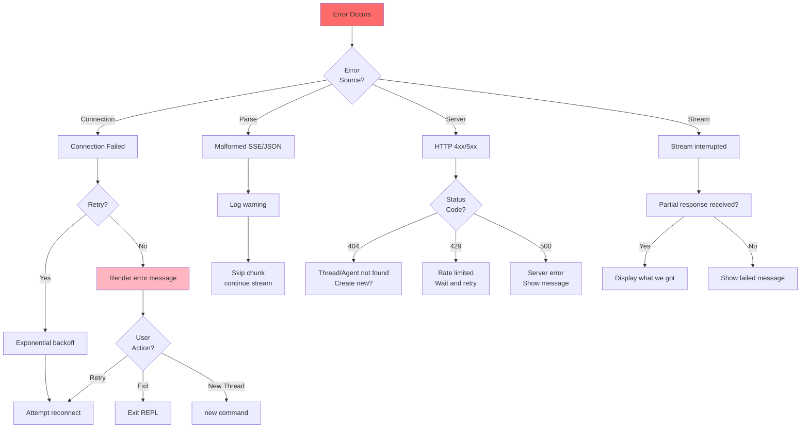

# REPL Data/Control Flow

This document visualizes the data and control flow through the REPL system as a Directed Acyclic Graph.

---

## Key Insights

### DAG Properties
1. **No cycles**: Data flows one direction - User → Input → Process → Render → Display
2. **Clear dependencies**: Each layer only depends on layers below it (lower numbers)
3. **Parallel opportunities**: Parsing and rendering are independent and could be parallelized
4. **State centralization**: SessionState is read by many, written by few

### Critical Paths
1. **Hot path**: User input → Stream → Parse → Render (latency-critical)
2. **HITL path**: Interrupt → Approval → Resume → Stream (user-blocking)
3. **Command path**: Input → Registry → Handler → Render (synchronous)

### Data Transformations
1. SSE string → (event_type, data) tuple
2. Raw dict → ParsedChunk dataclass
3. ParsedChunk → Rendered output
4. Usage metadata → Session token tracking

### Coupling Points
- Stream Handler is deliberately decoupled from Renderer (yields data, doesn't render)
- Command Handlers need Client, Session, and Renderer (tightly coupled)
- Main Loop orchestrates everything (central coordinator)

---

## Overall Architecture Flow

## Layer Dependencies (Build Order)

## Detailed Message Streaming Flow

## Data Structures Flow

## Command Flow vs Message Flow

## State Management

## Error Handling Flow

